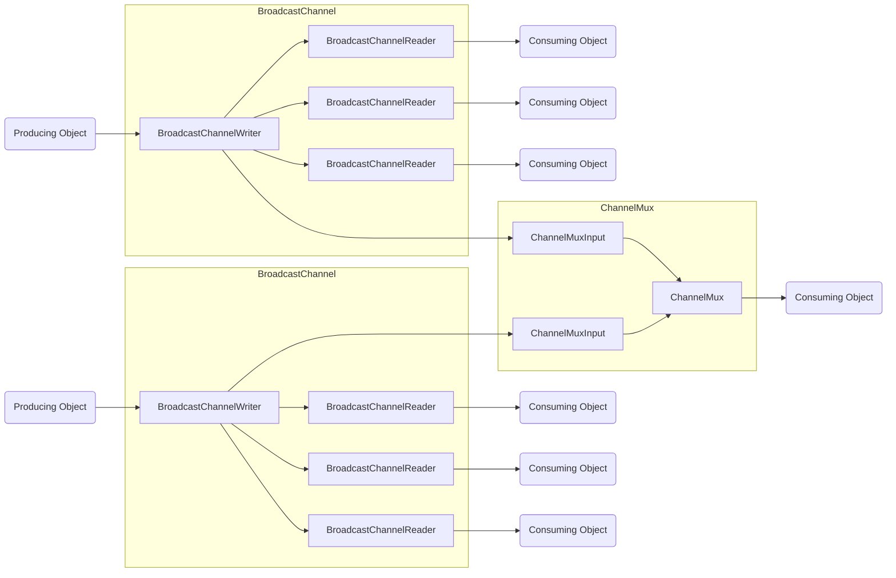

# `BroadcastChannel` and `ChannelMux`

## `BroadcastChannel`

Is a single input, multi output type where each output is guaranteed to receive all the data from the input. 
This is in contrast to `System.Threading.Channels.Channel` or a _Queue_ type where each input is only ever read by a 
single output.

## `ChannelMux`

`ChannelMux` is meant to aggregate multiple `BroadcastChannel` into a single, awaitable object. 
It is a generic type and each type parameter has a dedicated `TryRead(out T data)` method.
`ChannelMuxInput` acts presents as a writer to `BroadcastChannelWriter` and each has a
`SingleProducerSingleConsumerQueue`.

Note that each `ChannelMuxInput` is a single input, single output where _single_ means both a single instance writing
and a single instance reading, and thus can be optimized using `SingleProducerSingleConsumerQueue`.

