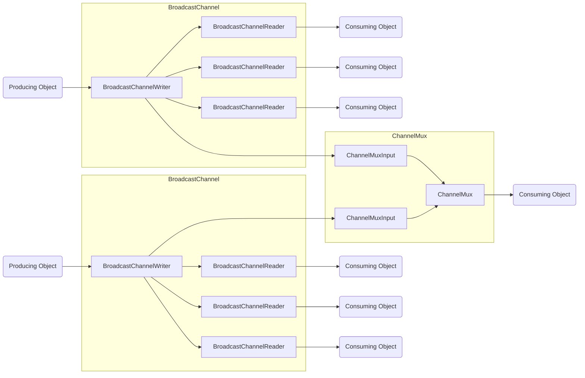

# `BroadcastChannel` and `ChannelMux`


[](https://www.hiller.pro/mkmrk.Channels/coverage/index.html)

- [ ] ==TODO: ADD NUGET PACKAGE LINK==

Available on [Nuget]()


# `BroadcastChannel` and `ChannelMux`

This library offers APIs similar to `Channel<T>` for scenarios where multiple readers need to receive all data being sent by a single writer. For example, a service which writes to a channel and multiple readers that each perform some task, such as data processing, analysis, or streaming over the network to a client. Additionally, with `ChannelMux`, multiple channels can be input to a single `await`able output.

In addition to standalone, direct instantiation, `BroadcastChannel` and `ChannelMux` are designed to work well with Generic Host based Dependency Injection.


## `BroadcastChannel`

Has a single input source/writer which writes to any number of readers, all of which are guaranteed to receive all written data.
This is in contrast to `System.Threading.Channels.Channel` or a _Queue_ type where each input is only ever read by a 
single output.


## `ChannelMux`

`ChannelMux` is meant to aggregate multiple `BroadcastChannel` into a single, awaitable object. 
It is a generic type and each type parameter has a dedicated `TryRead(out T data)` method.
`ChannelMuxInput` acts as a writer to `BroadcastChannelWriter` and each has a
`SingleProducerSingleConsumerQueue`.

Note that each `ChannelMuxInput` is a single input, single output where _single_ means both a single instance writing
and a single instance reading, and thus can be optimized using `SingleProducerSingleConsumerQueue`. `ChannelMux` is not meant to be shared across threads.




## Response Channels

`BroadcastChannel<T>` is a subclass of `BroadcastChannel<TData,TResponse>` where `TResponse` is a default implementation of the generic `IBroadcastChannelResponse` which provides the ability to pass an exception back to the writer (see [Response Channels](#response-channels)).

```cs
/// <summary>
/// Response message container
/// </summary>
public interface IBroadcastChannelResponse {
    /// <summary>
    /// Set to a <see cref="System.Exception"/> if one has occurred, else leave <c>null</c>
    /// </summary>
    public System.Exception? Exception { get; init; }
}
```

For more complex response types, use `BroadcastChannel<TData,TResponse>` directly.

<details>

<summary>Notes on examples</summary>

In this documentation `BroadcastChannel<T>` is used as a placeholder for both `BroadcastChannel<T>` and `BroadcastChannel<TData,TResponse>`, as the behavior is the identical between them. The same applies to `BroadcastChannelWriter<T>` and `BroadcastChannelReader<T>`.

</details>


## Usage

### `BroadcastChannel`

Much like `Channel<T>`, create a `BroadcastChannel` and use it to retrieve the writer as well as create new readers. `BroadcastChannel<T>.Writer` returns the single `BroadcastChannelWriter<T>` for the `BroadcastChannel<T>` and any amount of calls to a  `BroadcastChannel<T>`'s `.Writer` property will always return the same instance.

```cs
using var broadcastChannel = new BroadcastChannel<ChannelMessage, ChannelResponse>();
using BroadcastChannel<ChannelMessage, ChannelResponse> writer1 = broadcastChannel.Writer;
using BroadcastChannel<ChannelMessage, ChannelResponse> writer2 = broadcastChannel.Writer;
Object.ReferenceEquals( writer1, writer2 ); // true
```

`BroadcastChannelReader<T>`s are created with `BroadcastChannel<T>.CreateReader<T>()` which will always return a new `BroadcastChannelReader<T>` which will immediately begin receiving any data written by the associated `BroadcastChannelWriter<T>`.

```cs
using var broadcastChannel = new BroadcastChannel<ChannelMessage, ChannelResponse>();
using IBroadcastChannelReader<ChannelMessage, ChannelResponse> reader1 = broadcastChannel.CreateReader();
using IBroadcastChannelReader<ChannelMessage, ChannelResponse> reader2 = broadcastChannel.CreateReader();
Object.ReferenceEquals( reader1, reader2 ); // false
```


#### Response Channels

The response channel on a `BroadcastChannel` allows `BroadcastChannel` to return arbitrary data to the writer, such as status, errors, etc.

**Example**

```cs
using var broadcastChannel = new BroadcastChannel<ChannelMessage, ChannelResponse>();
using IBroadcastChannelReader<ChannelMessage, ChannelResponse> reader = broadcastChannel.CreateReader();
using BroadcastChannel<ChannelMessage, ChannelResponse> writer = broadcastChannel.Writer;

await reader.WriteResponseAsync( new ChannelResponse( -1, taskName, new EmptyException( "Incomplete sequence" ) ), ct );
if( writer.TryReadResponse( out ChannelResponse? response ) ){
    // work with response
}
```

### `ChannelMux`

#### Construction

Create `ChannelMux` from a set of `BroadcastChannelWriter`s.

```cs
BroadcastChannel<DataTypeA>      channel1         = new ();
BroadcastChannel<DataTypeB>      channel2         = new ();
ChannelMux<DataTypeA, DataTypeB> mux              = new (channel1.Writer, channel2.Writer);
```


#### Dependency Injection

`ChannelMux` can be injected using a Dependency Injection container. The below examples use `Microsoft.Extensions.DependencyInjection`.

```cs
var mux = _host.Services.GetRequiredService<ChannelMux<ChannelMessageSubA, ChannelMessageSubB, ChannelMessageSubC>>();
```

**Or to gain access to the `IBroadcastChannelReaderSource`**

```cs
var readerSourceA = _host.Services.GetRequiredService<IBroadcastChannelReaderSource<ChannelMessageSubA>>();
var readerSourceB = _host.Services.GetRequiredService<IBroadcastChannelReaderSource<ChannelMessageSubB>>();
var mux           = new ChannelMux<ChannelMessageSubA, ChannelMessageSubB>( readerSourceA, readerSourceB );
```

**An example of `ChannelMux` used with constructor based Dependency Injection.**

```cs
class ChannelMuxConsumer {
    private ChannelMux<ChannelMessageSubA, ChannelMessageSubB, ChannelMessageSubC>> _mux;


public ChannelMuxConsumer ( ChannelMux<ChannelMessageSubA, ChannelMessageSubB, ChannelMessageSubC>> mux) => this._mux = mux;
 
public void DoWork(){
    while ( await _mux.WaitToReadAsync( _cts.Token ) ) {
	    if ( _mux.TryRead( out ChannelMessageSubA? msgA ) ) {
	        // work with msgA
	    }
	    if ( _mux.TryRead( out ChannelMessageSubB? msgB ) ) {
	        // work with msgB
	    }
	    if ( _mux.TryRead( out ChannelMessageSubC? msgC ) ) {
	        // work with msgC
	    }
	}
}
```


#### Read

**Then loop and read**

```cs
while ( await mux.WaitToReadAsync( _cts.Token ) ) {
    if ( mux.TryRead( out ChannelMessageSubA? msgA ) ) {
        msgA.Id.Should().Be( receivedCountA );
        lastMsgA = msgA;
        receivedCountA++;
    }
    if ( mux.TryRead( out ChannelMessageSubB? msgB ) ) {
        msgB.Id.Should().Be( receivedCountB );
        lastMsgB = msgB;
        receivedCountB++;
    }
}
```


#### Replacing Channels

Individual channels can be replaced on a live `ChannelMux`. This is useful when the channels on a mux have different lifetimes. For example, most of the channels are long lived, but one channel is for smaller requests that return some data and then complete. By replacing a completed channel with a new one, the same mux can be used regardless of the lifetime of individual component channels.


```cs

using BroadcastChannel<DataTypeA> channel1            = new ();
using BroadcastChannel<DataTypeB> channel2            = new (); // this will be closed

using BroadcastChannel<DataTypeB> channelReplacement1 = new ();

using ChannelMux<DataTypeA, DataTypeB> mux = new (channel1.Writer, channel2.Writer);

// replacing an active channel will throw ChannelNotClosedException
mux.ReplaceChannel( channelReplacement1.Writer ); // throws

// to replace an active channel, use:
mux.ReplaceChannel( channelReplacement1.Writer, force: true );
// channelReplacement1 is now writing data into the mux
 
```


## Dependency Injection Configuration

Use `AddBroadcastChannels()` to automatically create a Broadcast Channel for any Data Type without any further configuration (with a non-specified (default `IBroadcastChannelResponse`) response type): 

```cs
Host.CreateDefaultBuilder( Array.Empty<string>() ).ConfigureServices( 
    services => {
	    services.AddBroadcastChannels();
    } ).Build();

var channel = host.Services.GetRequiredService<IBroadcastChannel<ChannelMessageSubA, ChannelResponse>>();
```

For a specific Channel Data and Response type use `AddBroadcastChannel<TData,TResponse>()` which must be run for each type pair desired:

```cs
Host.CreateDefaultBuilder( Array.Empty<string>() ).ConfigureServices( 
    services => {
	    services.AddBroadcastChannel<ChannelMessageSubA, ChannelResponse>();
	    services.AddBroadcastChannels();
    } ).Build();

var channel = host.Services.GetRequiredService<IBroadcastChannel<ChannelMessageSubA, ChannelResponse>>();
```

When a specific Channel Data and Response type are added to the service collection, the default is mapped to it as well.

In the example below, both `channelWithReponse` and `defaultResponseTypeChannel` will be on the same channel (and receive the same data). Also note that `AddBroadcastChannels()` and `AddBroadcastChannel<TData,TResponse>()` can be used together.

```cs
Host.CreateDefaultBuilder( Array.Empty<string>() ).ConfigureServices( 
    services => {
	    services.AddBroadcastChannel<ChannelMessageSubA, ChannelResponse>();
	    services.AddBroadcastChannels();
    } ).Build();

var channelWithReponse = host.Services.GetRequiredService<IBroadcastChannel<ChannelMessageSubA, ChannelResponse>>();

var defaultResponseTypeChannel = host.Services.GetRequiredService<IBroadcastChannel<ChannelMessageSubA>>();
```


## Things to keep in mind

- There is no (practical) limit to the amount of data that can be written to a channel. If a reader is created, but never read from, this could potentially consume a huge amount of memory. Under the hood, each `BroadcastChannelReader` uses an `UnboundedChannel`. 
  _There is no reason an unbounded channel must be used. The ability to specify a limit and options for the action to perform when that limit if reached (such as with `BoundedChannel`) could be a added in the future._

- Most, if not all types implement `IAsyncDisposable` or `IDisposable` and as such, if they are directly instantiated, they must be disposed of.
  **If the objects were acquired by Dependency Injection, the service container takes care of disposal and the programmer should not `.Dispose()` manually.**


### Readers must exist before their received data

A `BroadcastChannelReader` ***must*** be created before any data being written to it. This might seem obvious, but this isn't the case when using `System.Threading.Channels`. `System.Threading.Channels` has a single internal queue that all readers share where on each read, one value is removed from the queue whereas an independent data store is created for each new `BroadcastChannelReader`.

There is no intermediate queue where data resides waiting for a non-existent reader to read from it. If there is no reader created, then any data written to the `BroadcastChannelWriter` will simply be discarded. The reader can only receive data written after it's creation.

Example:
```cs
BroadcastChannel<int> channel = new ();
var writer = channel.Writer;
writer.TryWrite<int>( 1 );        // writer writes before reader is created
var reader = channel.GetReader(); // only at this point is the Reader's data queue allocated.
bool result = reader.TryRead( out int? data );
// result is false
// data is null
```


### Data types in `ChannelMux` must be unique

`ChannelMux<T1,T2>` has sub types (`ChannelMux<T1,T2>`, `ChannelMux<T1,T2,T3>`, etc.) with 2+ type parameters and these type parameters identify the type of a specific channel's data. The data types are used to differentiate the `TryRead<T>( out T )` methods. Unspecified mayhem may occur if the same type is passed in as a generic type argument for more than one type parameter.


## Future

- Allow responses via `BroadcastChannelReaderSource`


## Additional Information

- [API Docs](https://www.hiller.pro/mkmrk.Channels/)
- [Unit Tests](https://github.com/erichiller/mkmrk.Channels/tree/master/test/mkmrk.Channels.Tests)
- [Sample Console Program](https://github.com/erichiller/mkmrk.Channels/tree/master/test/mkmrk.Channels.Tests.Console)


## Contributions

Contributions and PRs are welcome.


****
