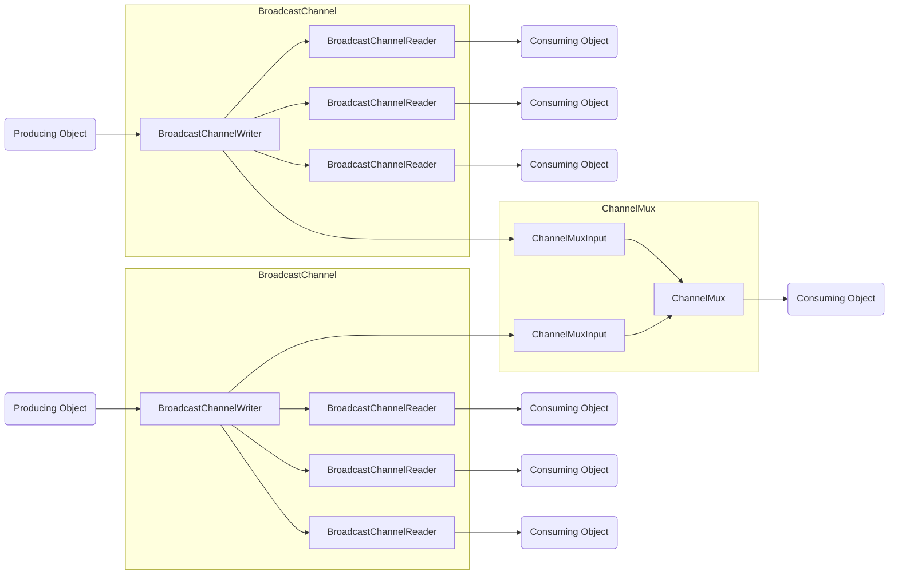

# `BroadcastChannel` and `ChannelMux`

<span>
[](https://github.com/erichiller/mkmrk.Channels/actions/workflows/test-pack-release.yaml)
</span>
<span>

</span>
<span>

</span>

This library offers APIs similar to `Channel<T>` for scenarios where multiple readers need to receive all data being sent by a single writer. For example, a service which writes to a channel and multiple readers that each perform some task, such as data processing, analysis, or streaming over the network to a client. Additionally, with `ChannelMux`, multiple channels can be input to a single `await`able output.

In addition to standalone, direct instantiation, `BroadcastChannel` and `ChannelMux` are particularly well suited to be used with Generic Host based Dependency Injection.


==TODO: ADD NUGET PACKAGE LINK==
Available on [Nuget]()

==TODO: Add build status (workflow badge)==


## `BroadcastChannel`

Is a single input, multi output type where each output is guaranteed to receive all the data from the input. 
This is in contrast to `System.Threading.Channels.Channel` or a _Queue_ type where each input is only ever read by a 
single output.

## `ChannelMux`

`ChannelMux` is meant to aggregate multiple `BroadcastChannel` into a single, awaitable object. 
It is a generic type and each type parameter has a dedicated `TryRead(out T data)` method.
`ChannelMuxInput` acts presents as a writer to `BroadcastChannelWriter` and each has a
`SingleProducerSingleConsumerQueue`.

Note that each `ChannelMuxInput` is a single input, single output where _single_ means both a single instance writing
and a single instance reading, and thus can be optimized using `SingleProducerSingleConsumerQueue`.



```mermaid
flowchart LR

    Producing_Object1("Producing Object") --> BroadcastChannelWriter1
    Producing_Object2("Producing Object") --> BroadcastChannelWriter2

    subgraph BroadcastChannel1 [BroadcastChannel]
        BroadcastChannelWriter1["BroadcastChannelWriter"]
        BroadcastChannelReader1_1["BroadcastChannelReader"]
        BroadcastChannelReader1_2["BroadcastChannelReader"]
        BroadcastChannelReader1_3["BroadcastChannelReader"]
    end
    BroadcastChannelReader1_1 --> Consuming_Object_BR1_1("Consuming Object")
    BroadcastChannelReader1_2 --> Consuming_Object_BR1_2("Consuming Object")
    BroadcastChannelReader1_3 --> Consuming_Object_BR1_3("Consuming Object")

    subgraph BroadcastChannel2 [BroadcastChannel]
        BroadcastChannelWriter2["BroadcastChannelWriter"]
        BroadcastChannelWriter2 --> BroadcastChannelReader2_1["BroadcastChannelReader"]
        BroadcastChannelWriter2 --> BroadcastChannelReader2_2["BroadcastChannelReader"]
        BroadcastChannelWriter2 --> BroadcastChannelReader2_3["BroadcastChannelReader"]
    end
    BroadcastChannelReader2_1 --> Consuming_Object_BR2_1("Consuming Object")
    BroadcastChannelReader2_2 --> Consuming_Object_BR2_2("Consuming Object")
    BroadcastChannelReader2_3 --> Consuming_Object_BR2_3("Consuming Object")
    
    subgraph ChannelMux
        ChannelMuxT_1["ChannelMux<T1,T2,...>"]
        ChannelMuxInput1["ChannelMuxInput"] --> ChannelMuxT_1
        ChannelMuxInput2["ChannelMuxInput"] --> ChannelMuxT_1
    end
    BroadcastChannelWriter1 --> ChannelMuxInput1

    BroadcastChannelWriter1 --> BroadcastChannelReader1_1
    BroadcastChannelWriter1 --> BroadcastChannelReader1_2
    BroadcastChannelWriter1 --> BroadcastChannelReader1_3
    BroadcastChannelWriter2 --> ChannelMuxInput2
    ChannelMuxT_1 --> Consuming_Object_1("Consuming Object")

    Consuming_Object_BR1_1 ~~~ ChannelMux
    Consuming_Object_BR2_1 ~~~ ChannelMux
    BroadcastChannel2 ~~~ ChannelMux

```

## Response Channels

`BroadcastChannel<T>` is a subclass of `BroadcastChannel<TData,TResponse>` where `TResponse` is a generic `IBroadcastChannelResponse` which provides the ability to pass an exception back to the writer.

```cs
public System.Exception? Exception { get; init; }
```
For more complex response types, use `BroadcastChannel<TData,TResponse>` directly.


==TODO: HOW TO HAVE A NOTIFICATION SECTION? RAW HTML? SOME SPECIAL THING GITHUB SUPPORTS?==
:note
In this documentation `BroadcastChannel<T>` is used as a placeholder for both `BroadcastChannel<T>` and `BroadcastChannel<TData,TResponse>`, as the behavior is the identical between them. The same goes for `BroadcastChannelWriter<T>` and `BroadcastChannelReader<T>`.


## Usage

### `BroadcastChannel`

Much like `Channel<T>`, create a `BroadcastChannel` and use it to retrieve the writer as well as create new readers. `BroadcastChannel<T>.Writer` returns the single `BroadcastChannelWriter<T>` for the `BroadcastChannel<T>` and any amount of calls to a  `BroadcastChannel<T>`'s `.Writer` property will always return the same instance.

#### Response Channels

==TODO: DESCRIPTION==

**Example**

```cs
using var broadcastChannel = new BroadcastChannel<ChannelMessage, ChannelResponse>();
using IBroadcastChannelReader<ChannelMessage, ChannelResponse> reader = broadcastChannel.CreateReader();
using BroadcastChannel<ChannelMessage, ChannelResponse> writer = broadcastChannel.Writer;

await reader.WriteResponseAsync( new ChannelResponse( -1, taskName, new EmptyException( "Incomplete sequence" ) ), ct );
if( writer.TryReadResponse( out ChannelResponse? response ) ){
    // work with response
}
```

### `ChannelMux`

#### Construction

Create `ChannelMux` from a set of `BroadcastChannelWriter`s.

```cs
BroadcastChannel<DataTypeA>      channel1         = new ();
BroadcastChannel<DataTypeB>      channel2         = new ();
ChannelMux<DataTypeA, DataTypeB> mux              = new (channel1.Writer, channel2.Writer);
```

==TODO==
**or any type that implements `XXXXXXX`**

```cs

```

#### Read

**Then loop and read**

```cs
while ( await mux.WaitToReadAsync( _cts.Token ) ) {
    if ( mux.TryRead( out ChannelMessageSubA? msgA ) ) {
        msgA.Id.Should().Be( receivedCountA );
        lastMsgA = msgA;
        receivedCountA++;
    }
    if ( mux.TryRead( out ChannelMessageSubB? msgB ) ) {
        msgB.Id.Should().Be( receivedCountB );
        lastMsgB = msgB;
        receivedCountB++;
    }
}
```

#### Dependency Injection

`ChannelMux` can be retrieved from Dependency Injection.

```cs
var mux = _host.Services.GetRequiredService<ChannelMux<ChannelMessageSubA, ChannelMessageSubB, ChannelMessageSubC>>();
```

**Or to gain access to the `IBroadcastChannelReaderSource`**

```cs
var readerSourceA = _host.Services.GetRequiredService<IBroadcastChannelReaderSource<ChannelMessageSubA>>();
var readerSourceB = _host.Services.GetRequiredService<IBroadcastChannelReaderSource<ChannelMessageSubB>>();
var mux           = new ChannelMux<ChannelMessageSubA, ChannelMessageSubB>( readerSourceA, readerSourceB );
```

**Of course, ChannelMux can be injected into Dependency Injection constructed objects.**

```cs
class ChannelMuxConsumer {
    private ChannelMux<ChannelMessageSubA, ChannelMessageSubB, ChannelMessageSubC>> _mux;


public ChannelMuxConsumer ( ChannelMux<ChannelMessageSubA, ChannelMessageSubB, ChannelMessageSubC>> mux) => this._mux = mux;
 
public void DoWork(){
    while ( await _mux.WaitToReadAsync( _cts.Token ) ) {
	    if ( _mux.TryRead( out ChannelMessageSubA? msgA ) ) {
	        // work with msgA
	    }
	    if ( _mux.TryRead( out ChannelMessageSubB? msgB ) ) {
	        // work with msgB
	    }
	    if ( _mux.TryRead( out ChannelMessageSubC? msgC ) ) {
	        // work with msgC
	    }
	}
}
```

#### Replacing Channels


## Dependency Injection Configuration


For any type of Channel with a non-specified (default `IBroadcastChannelResponse`) response type.

```cs
Host.CreateDefaultBuilder( Array.Empty<string>() ).ConfigureServices( 
    services => {
	    services.AddBroadcastChannels();
    } ).Build();

var channel = host.Services.GetRequiredService<IBroadcastChannel<ChannelMessageSubA, ChannelResponse>>();
```


For a specific Channel Data and Response type

```cs
Host.CreateDefaultBuilder( Array.Empty<string>() ).ConfigureServices( 
    services => {
	    services.AddBroadcastChannel<ChannelMessageSubA, ChannelResponse>();
	    services.AddBroadcastChannels();
    } ).Build();

var channel = host.Services.GetRequiredService<IBroadcastChannel<ChannelMessageSubA, ChannelResponse>>();
```

////

INCOMPLETE
WARNING ⚠️
Both

```cs
Host.CreateDefaultBuilder( Array.Empty<string>() ).ConfigureServices( 
    services => {
	    services.AddBroadcastChannel<ChannelMessageSubA, ChannelResponse>();
	    services.AddBroadcastChannels();
    } ).Build();

var channelWithReponse = host.Services.GetRequiredService<IBroadcastChannel<ChannelMessageSubA, ChannelResponse>>();

var channel = host.Services.GetRequiredService<IBroadcastChannel<ChannelMessageSubA>>();
```


## Things to keep in mind

- There is no (practical) limit to the amount of data that can be written to a channel. If a reader is created, but never read from, this could potentially consume a huge amount of memory. Under the hood, each `BroadcastChannelReader` uses an `UnboundedChannel`. 
  _There is no reason an unbounded channel must be used. The ability to specify a limit and options for the action to perform when that limit if reached (such as with `BoundedChannel`) could be a added in the future._

- Most, if not all types implement `IAsyncDisposable` or `IDisposable` and as such, if they are directly instantiated, they must be disposed of.
  **If the objects were constructed from Dependency Injection, the service container takes care of disposal and the programmer should not Dispose themselves.**


### Readers must exist before their received data

A `BroadcastChannelReader` ***must*** be created before any data being written to it. This might seem obvious, but this isn't the case when using `System.Threading.Channels`. `System.Threading.Channels` has a single internal queue that all readers share where on each read, one value is removed from the queue whereas an independent data store is created for each new `BroadcastChannelReader`.

There is no intermediate queue where data resides waiting for a non-existent reader to read from it. If there is no reader created, then any data written to the `BroadcastChannelWriter` will simply be discarded. The reader can only receive data written after it's creation.

Example:
```cs
BroadcastChannel<int> channel = new ();
var writer = channel.Writer;
writer.TryWrite<int>( 1 );        // writer writes before reader is created
var reader = channel.GetReader(); // only at this point is the Reader's data queue allocated.
bool result = reader.TryRead( out int? data );
// result is false
// data is null
```

### Data types in `ChannelMux` must be unique

`ChannelMux<T1,T2>` has sub types (`ChannelMux<T1,T2>`, `ChannelMux<T1,T2,T3>`, etc.) with 2+ type parameters and these type parameters identify the type of a specific channel's data. The data types are used to differentiate the `TryRead<T>( out T )` methods. Unspecified execution will occur if the same type is a generic type argument more than once.

## Future

- [ ] Allow responses via `BroadcastChannelReaderSource`

## Additional Information

- [Unit Tests](https://github.com/erichiller/mkmrk.Channels/tree/master/test/mkmrk.Channels.Tests)
- [Sample Console Program](https://github.com/erichiller/mkmrk.Channels/tree/master/test/mkmrk.Channels.Tests.Console)


==TODO: make these hidden Jetbrains Rider markdown Todos / comments ??==

==TODO: ADD BENCHMARKS ?==

==TODO: ADD CodeMetrics ?==

==TODO: ADD Unit test coverage ?==

==TODO: ADD API docs (via DocFX)?==


## Contributions

Contributions and PRs are welcome.


****


 [x] - Start with a clear and concise description: Start your README with a brief overview of what your package is and does, also what problem it solves.

Explain how to use it: Provide clear and concise getting started instructions for using your package, including any necessary steps.

Give examples: Provide concrete examples of how your package can be used to help users quickly understand its capabilities.

[x] Provide links to more resources: List links such as detailed documentation, tutorial videos, blog posts, or any other relevant documentation to help users get the most out of your package.

[x] Include screenshots or visuals: Enhance your README by including screenshots, diagrams, or other visual aids that help users better understand how to use your package.

Write down any limitations: Mention any limitations or known issues with your package and provide workarounds, if available.

Provide sample code: Provide sample code snippets to help users understand how to implement your package in their projects.

Make it visually appealing: Use clear headings, code blocks, etc. to make your README appealing and easy to navigate.